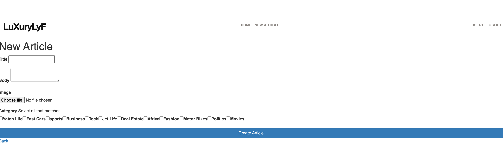
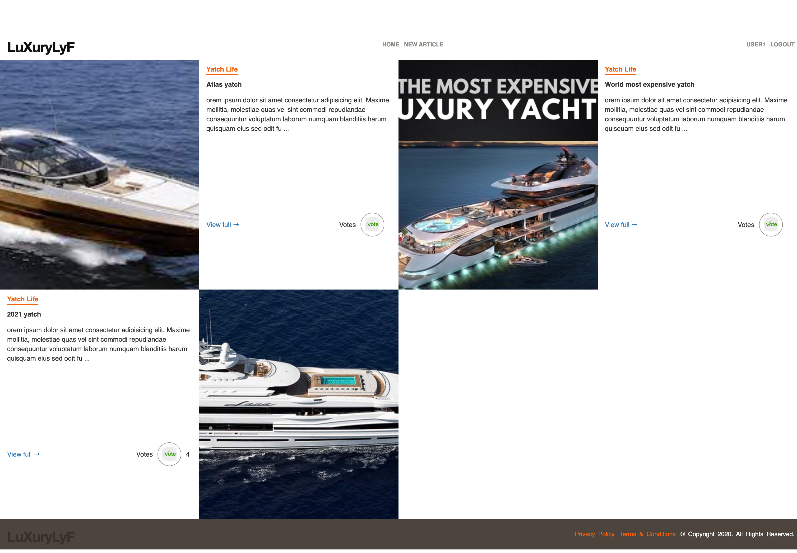

# README
Luxurylyf App with Ruby on Rails

This is an article based app featuring article categories, article posts, article votes, it is the ultimate hangout for luxury enthusiasts.

## Features

- User can log in only using the username
- User sees the homepage where the first row is the most voted article followed by all categories - listed with the most recent article's image and title
- User must Log in before submitting an article
- A user can see all articles under a category by clicking on the category
- Users can vote on each article.
- Users can further see the full detail of an article by clicking on view full [EXTRA Feature]

## Built With

- Ruby v2.7.0
- Ruby on Rails v6.1.0

## Live Demo

Check the live version demo [here](https://infinite-mesa-28355.herokuapp.com/)

## Presentation Video
Check out the presentation video[here](https://www.loom.com/share/4caa0c82a54741e0b6e5d8d9a323e741)

# Homepage


# New Article's Page


# Article's Page


## Getting Started

To get a local copy up and running, please follow these steps:

### Prerequisites

Ruby: 2.7.0
Rails 6.1.4
Postgres: >=9.5


### Setup

- Go to your terminal bash and, on any directory of your preference, run

```sh
git clone git@github.com:fortuneonyeka/ror_lifestyle_article.git
```
- Next, to go into the project root directory, run
cd ror_lifestyle_article

- To install all Ruby Gems this project requires, run

```sh
bundle install
```

```
bundle exec rails webpacker:install
```

Setup database with:

```
   rails db:create
   rails db:migrate
```

- Optionally, you can load some record samples for Users, categories, and articles Tables. To do it, simply run

```sh
rails db:seed
```

### Usage

Start server with:

```
    rails server
```

Open `http://localhost:3000/` in your browser.

### Run tests

```
    rspec
```

## Author

👤 **Fortunatus Onyeka**

- GitHub [fortuneonyeka](https://github.com/fortuneonyeka)
- Linkedin: [Fortunatus Ihedoro](https://www.linkedin.com/in/fortunatus-ihedoro/)


## Credits

Credit goes to [Nelson Sakwa](https://www.behance.net/sakwadesignstudio) for this wonderful templete. This project is a clone of  [this](https://www.behance.net/gallery/14554909/liFEsTlye-Mobile-version) design.


## 🤝 Contributing

Contributions, issues and feature requests are welcome!

Feel free to check the [issues page](issues/).

## Show your support

Give a ⭐️ if you like this project!
